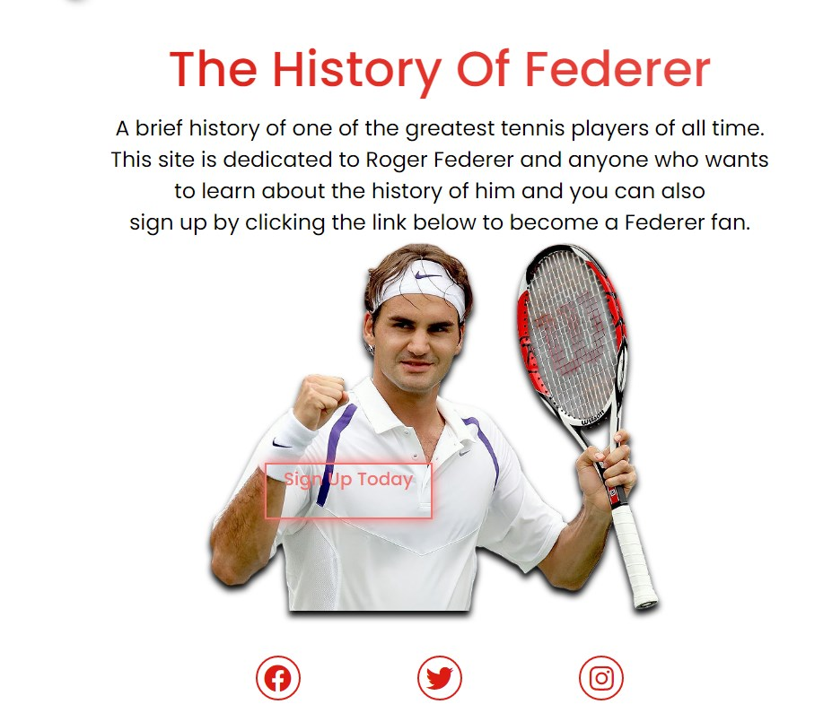

# Federer Website 
Federer Website is a dedicated website to Roger Federer which include his achievements and a history of his timeline.
 
This website is mainly for tennis fans who love Roger Federer and want to sign up to become a Fedfan within the community.
 
This is the Website of Roger Federer.

# Features 

Roger Federer website is designed to be user friendly and pleasing to the eye so when you first look at the website you can see where everthing is. It is very miminalistic but effective in a way that doesn't over complicate things. It has features that everyone has used before such as a navigation bar and a form to sign up.  

## Existing Features 

- __Navigation Bar__
    - Navigation Bar is fully responsive where it has three pages and a logo. These items are located at the top of the page and are very easy to access to as you go to different pages on the website as it will keep the same continuity across all pages.
     - The Logo is clickable which will bring you back to the home page if you cannot find your way back to the home page. 
     - There is an animation on the Logo everytime you access a new page or refresh the page to help you locate where it is.
     
     

 - __Home Page Image__
     - The main image when you view the home page for the first time is an animated picture of Federer to give you an eye catching moment of when the animation starts. 
     - It also blends in nicely with the background of the website with a shadow effect.
                                         

     - __Home Page Content__
         - Inside the home page we have a brief introduction about the history of Roger Federer and give an idea of what this page is about.

        - __Sign Up Button__

        - Underneath the content we have a sign up button where you can enter your name and email to join the Federer community. 
        - The colour on the button should be pleasing for the user to want to click on it as it pops more than the text above it.
        - When you click on it a form will appear in red to match the concept of the other colours. 
        

        - __The Footer__
        - The footer has three links that are all relevant to Roger Federer as the link to each of his social medias including Facebook, Twitter and Instagram.
        - When hovering over each social media link it will light up to indicate that you are hovering over it with your mouse which gives a good indication where your mouse is currently at.
        - When you click on the social media Icons it will open a new tab so you don't lose access to the website.
         

         __Timeline Page__
         - The Timeline page is there to give the user information about the History of Federer's career from his young days to where he is currently at.
         - There are suporting images during the timeline to give an idea of what he looked like during those periods.
         - These are facts about his career and are layed out for the user to read it easily and to follow along as you scroll through the page.
         - There is an animation effect that continues from the home page to keep the flow of the page going.

         

         __Gallery__
         - The Gallery Page showcases Federer's biggest achievement which are the Grand Slams.
         - There are 20 images in total and they are ordered from top to bottom to showcase each Grand Slam he won.
         - This gallery is great for people who want to see how sucessful he is and it is responsive and uniformed to fit the page.
          

        # Future Features
        - A community Page where Federer fans can discuss about tennis or Federer.
        - A video section that links to tributes of Federer career.

        # Technology used:
        - <a href="https://html.spec.whatwg.org/"> HTML5 for HTML </a>
        - <a href="https://www.w3.org/Style/CSS/Overview.en.html">CSS for styling </a>
        - <a href="https://www.gitpod.io/">Gitpod to Deploy </a>
        - <a href="https://github.com/">Github to host </a>
        - <a href="https://fontawesome.com/">Font Awesome for Social Icons</a>
        - <a href="https://fonts.google.com/">Google Fonts for the text</a>
      
      # Testing 
      - In this section I tested the code using <a href="https://validator.w3.org/nu/#textarea">WC3 Validator HTML</a>
       
     
          
      - Also I tested the code using <a href="https://jigsaw.w3.org/css-validator/">WC3 Validator CSS</a>
         
         

         - In the HTML part you can see I have a warning about not having a heading in the section footer but it does not effect the code but only a warning.
         ## Responsive
         - as you can see it scales down when viewing in a different size to keep it's shape so it stays uninterrpted.
          

          - As we get into mobile mode inside the gallery it changes it shape by going off one image so the images are still visable to see. 
          

          - I used Google Developer tool to test the responsiveness of the website.

          # Unfixed Bugs
          - The sign up button in the index page is not responsive and could not fix it to scale down when going into different screen sizes.

          

       
        
       
